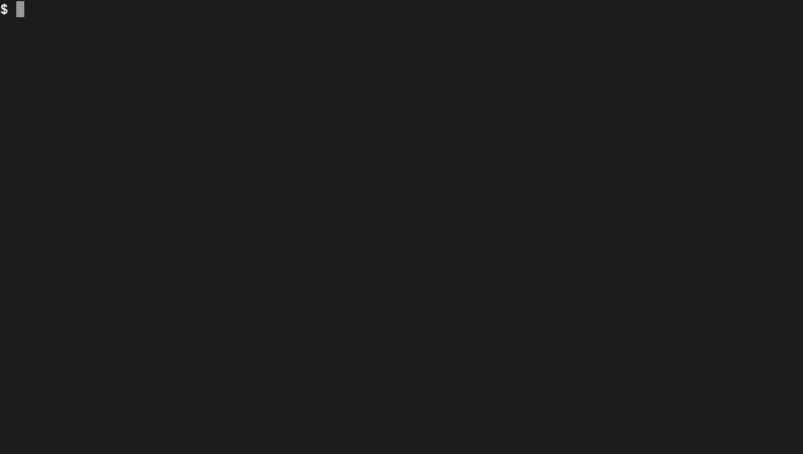

# PocketNext

<p align="center">
  
</p>

<p align="center">
  <a href="https://www.npmjs.com/package/pocketnext"></a>
  <a href="https://www.npmjs.com/package/pocketnext"></a>
  <a href="https://github.com/kacperkwapisz/pocketnext/blob/main/LICENSE"></a>
  
  
  
</p>

<p align="center">
  A minimalist, production-ready starter for building full-stack applications with <a href="https://nextjs.org">Next.js</a> and <a href="https://pocketbase.io">PocketBase</a>.
</p>

## 📋 Table of Contents

- [🚀 Quick Start](#-quick-start)
  - [Using the CLI (Recommended)](#using-the-cli-recommended)
  - [CLI Options](#cli-options)
  - [Manual Setup](#manual-setup)
- [🧪 Experimental Features](#-experimental-features)
- [🧰 Core Features](#-core-features)
- [📦 Installation Methods](#-installation-methods)
- [📄 Project Structure](#-project-structure)
- [🔧 Available Commands](#-available-commands)
- [🔐 Setting Up PocketBase Admin](#-setting-up-pocketbase-admin)
- [🛠 Advanced Features](#-advanced-features-optional)
- [📝 Development](#-development)
- [📚 Learn More](#-learn-more)
- [❓ Troubleshooting](#-troubleshooting)
- [📄 License](#-license)

## 🚀 Quick Start

### Using the CLI (Recommended)

```bash
# Create a new project using bunx
bunx pocketnext@latest my-app

# OR use bun create (recommended)
bun create pocketnext my-app

# Navigate to your project
cd my-app

# Start the development environment
bun dev
```

### Project Profiles

PocketNext offers a streamlined project creation experience with pre-configured profiles:

| Profile        | Description                                        |
| -------------- | -------------------------------------------------- |
| **Minimal**    | Basic setup with essential features only           |
| **Standard**   | Recommended setup for most projects (default)      |
| **Production** | Full setup with CI/CD and deployment configuration |
| **Custom**     | Choose each option individually                    |

You can select a profile during the interactive setup or specify it directly:

```bash
# Create a project with minimal configuration
bunx pocketnext@latest my-app --profile=minimal

# Create a production-ready project
bunx pocketnext@latest my-app --profile=production

# Quick setup with sensible defaults
bunx pocketnext@latest my-app --quick
```

### CLI Options

All commands support these options:

| Option                    | Description                                                          |
| ------------------------- | -------------------------------------------------------------------- |
| `--profile=<profile>`     | Select project setup profile (minimal, standard, production, custom) |
| `--quick`                 | Quick setup with minimal prompts                                     |
| `--use-npm/yarn/pnpm/bun` | Choose a package manager                                             |
| `-y, --yes`               | Skip interactive prompts and use defaults                            |
| `--skip-install`          | Skip package installation                                            |
| `--scripts <option>`      | Automate PocketBase setup (runAndKeep or runAndDelete)               |
| `--pb-version <version>`  | Install specific PocketBase version                                  |
| `--help`                  | Show all available options                                           |

```bash
# Example with multiple options
bunx pocketnext@latest my-app --profile=production --use-bun --skip-install
```

### Manual Setup

```bash
# Clone the repository
git clone https://github.com/kacperkwapisz/pocketnext.git
cd pocketnext

# Option 1: Copy the template folder to your project location
cp -r templates/default /path/to/your-project
cd /path/to/your-project

# Option 2: Or use the CLI directly from the repository
bun install
bun build
bun start my-app  # This runs the CLI to create a new project

# After either option, set up the project
cd my-app  # If using Option 2
bun install
bun setup  # Downloads PocketBase
bun dev    # Start development environment
```

Visit:

- **Frontend**: [http://localhost:3000](http://localhost:3000)
- **PocketBase Admin**: [http://localhost:8090/\_/](http://localhost:8090/_/)

## 🧪 Experimental Features

### Monorepo Template

PocketNext offers a monorepo template option. This template uses Turborepo to organize your project into a monorepo structure with shared packages.

```bash
# Use the interactive CLI to select template
npx pocketnext my-app

# OR explicitly select the monorepo template
npx pocketnext my-app --template monorepo
```

The monorepo template includes:

- Next.js app in `apps/web`
- Shared UI components in `packages/ui`
- Turborepo for build orchestration
- All the standard PocketNext features

## 🧰 Core Features

<div align="center">

| Feature                   | Description                                      |
| ------------------------- | ------------------------------------------------ |
| **⚡ Next.js 15**         | Latest version with App Router                   |
| **🔄 PocketBase Backend** | Database, auth, file storage, and real-time API  |
| **🎨 Tailwind CSS**       | Utility-first CSS framework                      |
| **🔍 TypeScript**         | Full type safety for your codebase               |
| **🛠️ Dev Tools**          | Live reload for both frontend and backend        |
| **💻 Interactive CLI**    | Customizable project creation                    |
| **📱 Responsive Design**  | Mobile-first approach                            |
| **🔒 Authentication**     | Built-in auth system via PocketBase              |
| **🔥 Hot Reload**         | Fast refresh for rapid development               |
| **🏗️ Robust Setup**       | Multi-strategy template handling for reliability |

</div>

## 📦 Installation Methods

PocketNext can be installed in several ways:

```bash
# Using bun (recommended)
bun create pocketnext my-app

# Using bunx
bunx pocketnext@latest my-app

# Using npx
npx pocketnext@latest my-app
```

## 📄 Project Structure

### CLI Project Structure

```
pocketnext/
├── src/                # Source code for CLI
│   ├── core/           # Core functionality
│   ├── utils/          # Utility functions
│   └── types/          # TypeScript types
├── templates/          # Project templates
├── public/             # Static assets
├── scripts/            # Helper scripts
└── dist/               # Compiled CLI code (generated)
```

### Generated Project Structure

```
your-project/
├── public/             # Static assets
├── scripts/            # Helper scripts
├── src/
│   ├── app/            # Next.js application with App Router
│   │   ├── api/        # API routes
│   │   ├── auth/       # Auth-related pages
│   │   └── (routes)/   # Application routes
│   ├── components/     # React components
│   │   ├── ui/         # UI components
│   │   └── layout/     # Layout components
│   └── lib/            # Shared utilities
│       └── pocketbase/ # PocketBase client & types
├── pocketbase/         # PocketBase binary (generated)
├── .env                # Environment variables
└── docker-compose.yml  # Docker configuration (if selected)
```

## 🔧 Available Commands

| Command            | Description                                       |
| ------------------ | ------------------------------------------------- |
| `bun dev`          | Start Next.js and PocketBase for development      |
| `bun dev:next`     | Start only Next.js development server             |
| `bun dev:pb`       | Start only PocketBase server                      |
| `bun dev:pb:admin` | Start PocketBase with admin setup prompt          |
| `bun build`        | Build Next.js for production                      |
| `bun start`        | Start Next.js production server                   |
| `bun setup`        | Install dependencies and download PocketBase      |
| `bun setup:db`     | Only download PocketBase                          |
| `bun setup:admin`  | Set up PocketBase admin credentials interactively |
| `bun typegen`      | Generate TypeScript types from PocketBase schema  |
| `bun lint`         | Run ESLint to check code quality                  |

## 🔐 Setting Up PocketBase Admin

For security reasons, the default PocketBase setup doesn't include admin credentials. You have several options:

1. **Interactive Setup**:

   ```bash
   bun setup:admin
   ```

   This will prompt you for admin email and password, with an option to save to your .env file.

2. **Run with Admin Prompt**:

   ```bash
   bun dev:pb:admin
   ```

   Similar to above but runs PocketBase after setup.

3. **Use Environment Variables**:
   Add to your .env file:

   ```
   PB_ADMIN_EMAIL=your-email@example.com
   PB_ADMIN_PASSWORD=your-secure-password
   ```

   Then run with admin mode: `bun dev:pb:admin`

4. **First-Run Setup**:
   Just run PocketBase normally and create admin account through the web UI:
   ```bash
   bun dev:pb
   ```
   Then visit http://localhost:8090/\_/ and follow the setup instructions.

## 🛠 Advanced Features (Optional)

<details>
<summary><b>🐳 Docker Deployment</b></summary>

This project includes a production-ready Docker setup for deployment.

```bash
# Copy the example environment file
cp .env.example .env

# Build and start containers
docker-compose up -d
```

The Docker setup provides:

- Separate containers for Next.js and PocketBase
- Health checks for reliability
- Volume mounting for persistent data
- Environment variable configuration
</details>

<details>
<summary><b>🚢 CI/CD with GitHub Actions</b></summary>

Pre-configured GitHub workflows for continuous integration and deployment:

- **CI Workflow**: Builds and tests your application
- **Deployment to Coolify**: Automatically deploys to [Coolify](https://coolify.io/) hosting

To enable Coolify deployment:

1. Add `COOLIFY_WEBHOOK` and `COOLIFY_TOKEN` secrets to your GitHub repository
2. Use the `docker-compose.coolify.yml` in your Coolify configuration
</details>

<details>
<summary><b>🧪 Type Generation</b></summary>

Generate TypeScript types from your PocketBase schema:

```bash
bun typegen
```

This creates types in `src/lib/pocketbase/types.ts` for type-safe database operations.

</details>

<details>
<summary><b>🔄 Real-time Subscriptions</b></summary>

PocketBase offers real-time subscriptions to collection changes:

```typescript
// In your Next.js component
import { pb } from "@/lib/pocketbase";

// Subscribe to changes
const unsubscribe = pb.collection("posts").subscribe("*", (data) => {
  console.log("New data received:", data);
  // Update your UI with the new data
});

// Clean up when done
useEffect(() => {
  return () => unsubscribe();
}, []);
```

This enables building reactive applications that update in real-time.

</details>

## 📝 Development

<details>
<summary><b>📜 Changelog</b></summary>

See the [CHANGELOG.md](CHANGELOG.md) for a detailed list of changes in each version.

</details>

<details>
<summary><b>🧑‍💻 Contributing</b></summary>

Contributions are welcome! Please feel free to submit a Pull Request.

1. Fork the repository
2. Create your feature branch: `git checkout -b feature/amazing-feature`
3. Commit your changes: `git commit -m 'Add some amazing feature'`
4. Push to the branch: `git push origin feature/amazing-feature`
5. Open a Pull Request

</details>

## ❓ Troubleshooting

<details>
<summary><b>Common Issues</b></summary>

### PocketBase fails to start

Check if port 8090 is already in use:

```bash
lsof -i :8090
```

If so, you can change the port in the `.env` file:

```
PB_PORT=8091
```

### Next.js build fails

If you encounter issues during build, ensure all dependencies are installed:

```bash
bun install
```

Also check for any TypeScript errors:

```bash
bun typecheck
```

### Template fetching issues

If you encounter problems with template fetching:

1. Ensure you have Git installed and available in your PATH
2. Check your internet connection
3. If you're behind a firewall or proxy, try using the `--quick` flag which uses simpler fetching strategies
4. As a last resort, you can manually clone the repository and copy the template directly:

```bash
# Clone the repository
git clone https://github.com/kacperkwapisz/pocketnext.git

# Copy the template to your project location
cp -r pocketnext/templates/default my-app

# Navigate to your project and set it up
cd my-app
bun install
bun setup:db  # Download PocketBase
```

### Type errors with PocketBase collections

If you're experiencing type errors when accessing PocketBase collections, regenerate the types:

```bash
bun typegen
```

</details>

## 📚 Learn More

- [Next.js Documentation](https://nextjs.org/docs)
- [PocketBase Documentation](https://pocketbase.io/docs/)
- [Tailwind CSS Documentation](https://tailwindcss.com/docs)
- [TypeScript Documentation](https://www.typescriptlang.org/docs/)

## 📄 License

This project is licensed under the MIT License - see the [LICENSE](LICENSE) file for details.

<!-- ---

<p align="center">
  Made with ❤️ by <a href="https://github.com/kacperkwapisz">Kacper Kwapisz</a>
</p> -->
